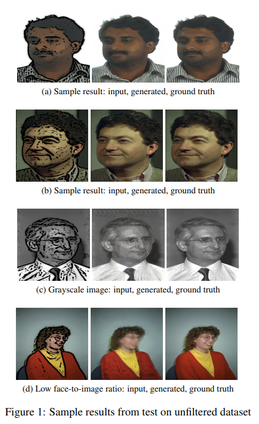
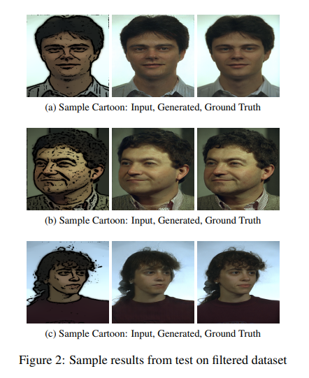
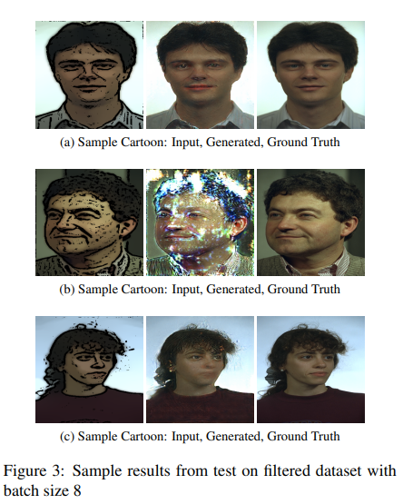
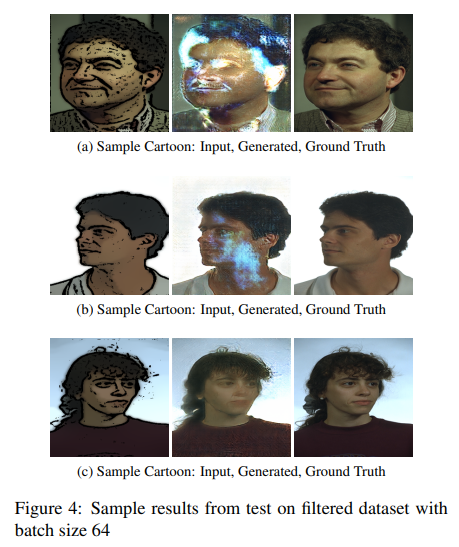
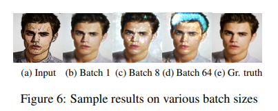
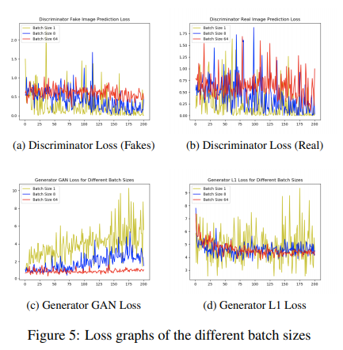
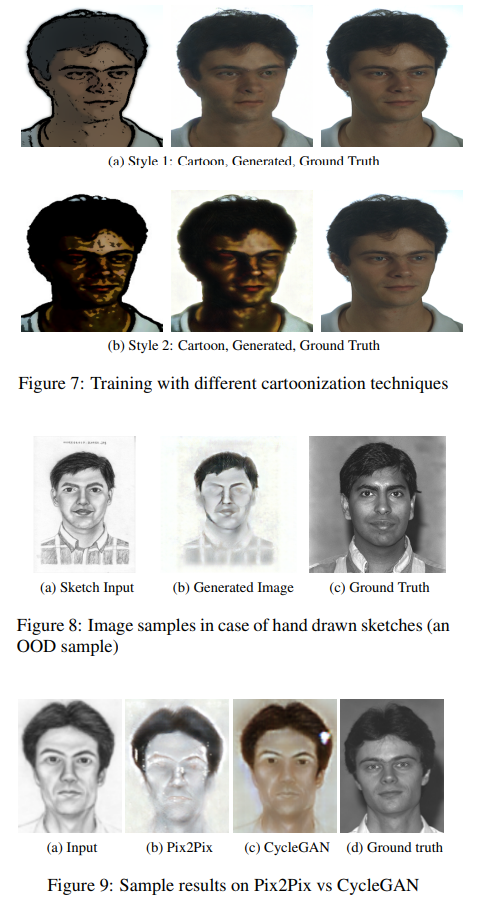
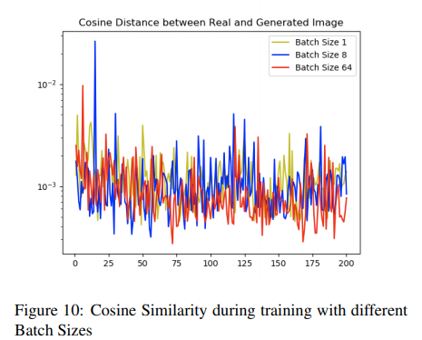
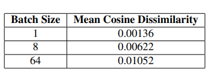

# cGANs for Cartoon to Real-life Images

## Problem Statement
This  project  aims  to  evaluate  the  robustness  of  thePix2Pix model by applying the Pix2Pix model to datasets consisting of cartoonized images. Using the Pix2Pix model,it should be possible to train the network to generate real-life images from the cartoonized images. The questions this project seeks to answer are:

1.  Does the default set of hyper parameters of the original implementation work well on this cartoonized dataset?

2.  Does  the  model  properly  recreate  facial  expressionsand postures?

The project’s experiment attempts to explore the robustness of the multi-purpose Pix2Pix model.  The problem is to determine whether, under the standard hyper-parameters,Pix2Pix can accurately recreate the facial features of the images in the original distribution based on cartoonized version of the images.

## Dataset

The dataset selected to train the Pix2Pix model is based on  an  adaption  of  the  [colorFERET](https://www.nist.gov/itl/iad/image-group/color-feret-database)  facial  image  data.The colorFERET database contains 11337 images of faces in  different  angles  and  postures.   These  images  are  taken from  1199  individuals  and  are  typically  used  for  facial recognition research. The  image  data  is  provided  in  two  versions:  a  higher resolution (512x768) and a lower resolution (256x384) version. In this project, the lower resolution version was used,in attempt to constrain the training duration.

## Data Pre-Processing

To  obtain  the  actual  data  for  training  and  testing the network, a modified version of an [OpenCV cartoonizer](https://cloudinary.com/blog/help_users_toon_into_your_site_with_a_cartoon_effect) script was run on selected images to generate their cartoon versions.  The pair of the cartoon and real images are then used as an input to the Pix2Pix model.

## Data Filtering

After the first evaluation of the network,  it was seen that the network seemed to performed badly due to the presence of some intermittent grayscale images,  as well as images with low face-to-image ratio, where the person’s face only cover a small portion of the full image. These images were later removed through manual inspection to create the filtered dataset.  The filtered dataset contains a total of 8933 images which was divided into three parts:  60% for training, 20% for testing and 20% for validation.

## Data Augmentation 

For further evaluation through data augmentation, a set of images were used to create 4 different types of cartoons by varying the parameters of the OpenCV script such as image blurring,  gray-scale percentage,  etc.   A total of 7,858 images were used for this purpose. In order to bring in domain adaptation and test its effect, the equivalent CycleGAN network was used for this purpose.

## Evaluation

The result is initially analyzed visually and later we use the cosine dissimilarity to quantitatively evaluate our network.

## Results

  

 

## Comparison with CycleGAN

We trained our dataset on the CycleGAN framework and compared its test results, shown in Figure 9b, with those of Pix2Pix, Figure 9c. It can be observed here that CycleGAN outputs a much better image.  CycleGAN does not remove the person’s eyes and is able to approximate the color of the person’s skin.

## Quantitative Evaluation of Generated Images using Cosine Similarity

Cosine dissimilarity is a measure of the similarity between two vectors. Since the generated image and the target image are themselves representable as vectors, it is therefore possible to use the cosine dissimilarity to measure how close the two images are.

 

From Figure 10, it can be seen that on average, the cosine  dissimilarity  between  the  different  batch  sizes  is  the same. However, in line with the observations made through a visual inspection,  table shows that the model trained with a batch size of 1 has the lowest cosine value and that the higher the batch size the worse the score. The disparity between this observation and that obtained when comparing the dissimilarity during training suggests that the higher batch size models do not generalize as well as the model with a batch size of 1.

# How to use?

## Platform Requirements-

PyTorch 0.41+ |
Linux or macOS |
Python 3 |
CPU or NVIDIA GPU + CUDA CuDNN

## Installation-

Clone this repo:
1) `git clone https://github.com/junyanz/pytorch-CycleGAN-and-pix2pix`
2) `cd pytorch-CycleGAN-and-pix2pix`
3) Install dependencies such as touchvision, visdom, and dominate using `pip install -r requirements.txt`
4) Visualize training results and loss plots, run `python -m visdom.server`and click the URL http://localhost:8097
5) See `options/train_options.py`and `options/base_options.py` for the training flags; see `options/test_options.py and options/base_options.py` for the test flags.
6) Set --gpu_ids -1 to use CPU mode; set --gpu_ids 0,1,2 for multi-GPU mode (Large batch size is needed to benefit from multiple GPUs) 
7) The intermediate results are saved inside `checkpoint` folder as an HTML file

## Download Dataset
Use this link https://drive.google.com/file/d/1ZnVPnGGvlsD1FtPIFrxNgOyi4wEDseLw/view?usp=sharing
Extract all data in one folder, and then divide it into train and test set.

## How to run Pix2Pix?

### Training-
`python3 train.py --dataroot path_to_dataset --name cartoon_pix2pix --model pix2pix --direction BtoA`

### Testing-
`python3 test.py --dataroot path_to_dataset --name cartoon_pix2pix --model test --netG unet_256 --direction BtoA --dataset_mode single --norm batch`

## How to run CycleGAN?

### Training-
`python3 train.py --dataroot path_to_dataset --preprocess scale_width_and_crop --load_size 128 --crop_size 128 --name cartoon_cycle_gan --model cycle_gan`

### Testing-
`python3 test.py --dataroot path_to_dataset --name cartoon_cycle_gan --model test --no_dropout --preprocess scale_width --load_size 128`
